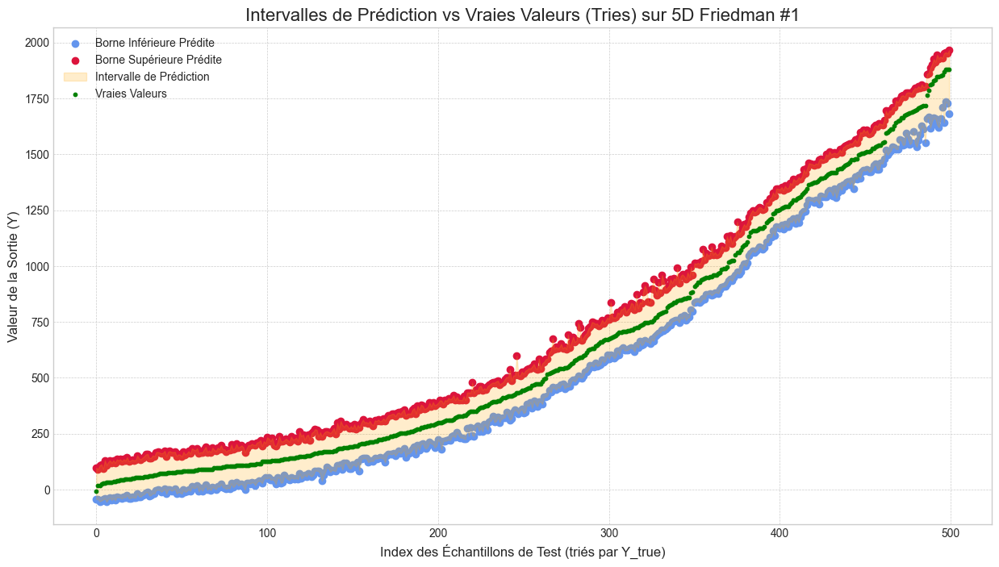
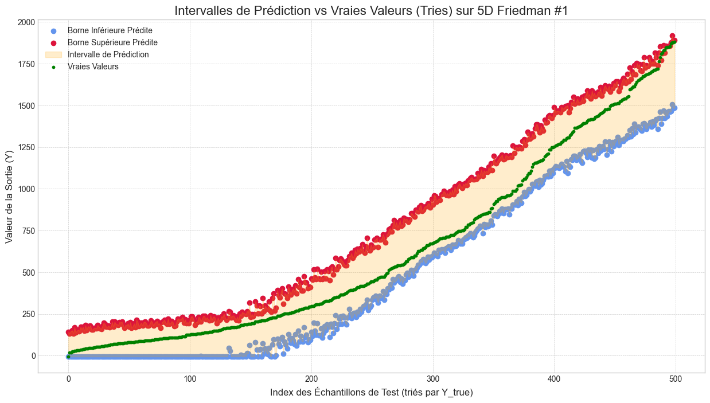

# 🧠 MacsumNet & HybridNet: Architectures Neuronales pour la Régression par Intervalles

Ce dépôt présente une nouvelle famille de modèles de deep learning pour la **régression par intervalles**, une tâche visant à prédire un intervalle `[borne_inférieure, borne_supérieure]` plutôt qu'une valeur unique. Le point culminant de ce projet de recherche est **`HybridNet`**, une architecture flexible qui fusionne la puissance d'extraction de caractéristiques des perceptrons traditionnels avec un nouvel opérateur d'agrégation dépendant de l'ordre, appelé **`Macsum`**.

Le résultat est un modèle capable de quantifier son incertitude, une propriété essentielle pour des applications fiables en IA.


*Exemple de prédiction d'intervalles par un modèle `HybridNet`. L'intervalle prédit (zone ombrée) encadre avec succès la vérité terrain (points).*

---

### Navigation
- [Motivation](#🎯-motivation--aller-au-delà-de-la-prédiction-ponctuelle)
- [L'Opérateur Macsum](#⚙️-lopérateur-macsum)
- [Architectures Développées](#🏗️-architectures-développées)
- [Structure du Dépôt](#📁-structure-du-dépôt)
- [Installation](#🚀-installation-et-démarrage)
- [Exemple d'Utilisation](#🧪-exemple-dutilisation)
- [Résultats](#📊-résultats-et-analyses)
- [Perspectives](#🔭-perspectives-et-travaux-futurs)

---

## 🎯 Motivation : Aller au-delà de la Prédiction Ponctuelle

Les modèles de régression classiques fournissent des prédictions ponctuelles, occultant toute notion d'incertitude. Dans des domaines critiques comme la finance, la météorologie ou la maintenance prédictive, cette information est pourtant cruciale. La régression par intervalles répond à ce besoin en encadrant la vérité terrain par un intervalle de confiance. Ce projet vise à concevoir des réseaux de neurones profonds capables de produire nativement et efficacement de tels intervalles.

---

## 📄 Rapport de Recherche

Une description détaillée de la motivation, des fondements théoriques, de l'architecture du modèle et de l'analyse des résultats est disponible dans le rapport de recherche complet rédigé pour ce projet.

➡️ **[Lire le rapport complet (PDF)](./rapport.pdf)**

---


## ⚙️ L'Opérateur Macsum

Au cœur de notre approche se trouve **l'opérateur Macsum**, un agrégateur non linéaire dont la particularité est d'être basé sur le **tri** des caractéristiques d'entrée selon un vecteur de poids appris `φ`. Contrairement aux opérateurs classiques comme la somme ou la moyenne, Macsum exploite l'**ordre** des features pour modéliser des interactions complexes, ce qui le rend particulièrement apte à construire des bornes de prédiction robustes.

---

## 🏗️ Architectures Développées

### 🔹 MacsumNet : Un Réseau Homogène

Une première approche a consisté à construire un réseau profond composé uniquement de couches `Macsum`. Bien que fonctionnelle, cette architecture a révélé des instabilités lors de l'optimisation, soulignant la difficulté d'entraîner des réseaux profonds basés sur des non-linéarités aussi exotiques.

### 🔹 HybridNet : Le Meilleur des Deux Mondes

Le modèle phare de ce projet, `HybridNet`, a été conçu pour surmonter ces limitations en adoptant une approche synergique :
- **Couches `Linear` + Activation :** Agissent comme des extracteurs de caractéristiques universels, transformant les données brutes en un espace de représentation sémantiquement plus riche.
- **Couches `Macsum` + Activation :** Se spécialisent dans l'agrégation de ces caractéristiques de haut niveau pour produire l'intervalle final.

Pour permettre cette hétérogénéité, les couches `Linear` ont été étendues pour manipuler des intervalles en s'appuyant sur l'**arithmétique des intervalles** formalisée par Ramon E. Moore :
```math
y_{\text{lower}} = W^+ x_{\text{lower}} - W^- x_{\text{upper}} + b \\
y_{\text{upper}} = W^+ x_{\text{upper}} - W^- x_{\text{lower}} + b
```
où `W⁺ = max(0, W)` et `W⁻ = max(0, -W)`. Cette combinaison permet d'allier la stabilité des MLP à la puissance de modélisation de `Macsum`.

---

## 📁 Structure du Dépôt

```
.
├── Code/
│   ├── Numpy/                  # Implémentation initiale (legacy)
│   └── Torsh/                  # Implémentation PyTorch finale
│       ├── NetowrkMacsum.py   # Définition des architectures (HybridNet, etc.)
│       ├── TorchMacsumAggregationLearning.py   # Classe de base Macsum et fonctions d'entraînement
│       └── Torsh_data_generation.py            # Scripts pour générer des données synthétiques
│
├── Experimentation/           # Collection de graphiques et résultats d'expériences
├── noteboock_test/            # Notebooks Jupyter pour les tests, l'exploration et la visualisation
├── rapport.tex                # Rapport de stage au format LaTeX
└── README.md                  # Ce fichier
```

---

## 🚀 Installation et Démarrage

Ce projet a été développé et testé avec **Python 3.9**. Il est recommandé d'utiliser une version de Python >= 3.9 pour assurer la compatibilité.

Pour explorer le code et lancer vos propres expériences, suivez ces étapes :

1.  **Clonez le dépôt :**
    ```bash
    git clone https://github.com/Isaac-KD/Macsum-aggregation-learning---Stage-LIP6--.git
    cd Macsum-aggregation-learning---Stage-LIP6--
    ```

2.  **Créez un environnement virtuel (recommandé) :**
    ```bash
    python3 -m venv venv
    source venv/bin/activate  # Sur macOS/Linux
    # venv\Scripts\activate   # Sur Windows
    ```
3.  **Installez les dépendances via le fichier `requirements.txt` :**
    ```bash
    pip install -r requirements.txt
    ```
    **Installez les dépendances sans le fichier**
    ```bash
    pip install torch numpy pandas matplotlib scikit-learn tqdm plotly typing-extensions
    ```

---

## 🧪 Exemple d'Utilisation

`HybridNet` est conçu pour être simple à utiliser. Voici un exemple complet pour entraîner un modèle :

```python
import torch.nn.functional as F
import numpy as np
from Code.Torsh.NetowrkMacsum import HybridNet
from Code.Torsh.TorchMacsumAggregationLearning import MacsumSigmoidTorch
from Code.Torsh.Torsh_data_generation import generate_friedman1_data

# 1. Pour la démonstration, créons des données factices
N_SAMPLES, N_FEATURES = 1000, 10
X, Y = generate_friedman1_data(N_SAMPLES, N_FEATURES, noise_std=0.0)
X_test, Y_test = generate_friedman1_data(500, N_FEATURES, noise_std=0.0)

# 2. Définissez une architecture profonde et hétérogène
architecture = [
    {'type': 'linear', 'neurons': 128, 'activation': F.leaky_relu},
    {'type': 'linear', 'neurons': 64, 'activation': F.leaky_relu},
    {'type': 'macsum', 'neurons': 32, 'activation': F.leaky_relu},
    {'type': 'linear', 'neurons': 16, 'activation': F.leaky_relu},
    {'type': 'macsum', 'neurons': 1} # Couche de sortie
]

# 3. Initialisez le modèle avec ses hyperparamètres
model = HybridNet(
    input_dim=N_FEATURES,
    architecture=architecture,
    macsum_model_class=MacsumSigmoidTorch,
    alpha=0.1,      # Poids de la largeur de l'intervalle
    gamma=2.0,      # Poids de la pénalité de non-contenance
    k_sigmoid=0.1
)

# 4. Lancez l'entraînement avec la méthode autograd
model.fit_autograd(
    X_train, Y_train,
    X_eval, Y_eval,
    learning_rate=1e-4,
    n_epochs=500,
    weight_decay=1e-5 # Régularisation pour éviter le sur-apprentissage
)
```

---

## 📊 Résultats et Analyses

Les architectures hybrides, en particulier les topologies profondes comme **`4L-2M-2L-1M`**, se sont montrées particulièrement performantes. Elles parviennent à générer des intervalles qui sont à la fois **précis** (faible largeur) et **fiables** (haut taux de couverture), même sur des jeux de données complexes.

> 

L'analyse des dynamiques d'entraînement a révélé des phénomènes intéressants, comme l’**effondrement de la borne inférieure à zéro**. Ce problème a été diagnostiqué comme une "solution paresseuse" de l'optimiseur et corrigé en ajustant les hyperparamètres de la fonction de coût (notamment le ratio `alpha`/`gamma`) et en favorisant des architectures qui débutent par des couches `Linear` pour stabiliser l'extraction de caractéristiques.

---


## 🔭 Perspectives et Travaux Futurs

Ce framework est une fondation solide pour de nombreuses explorations passionnantes :

-   **Intégration CNN :** Étendre `HybridNet` pour la régression par intervalles sur des images en développant des couches de convolution compatibles avec l'arithmétique des intervalles.
-   **Séries Temporelles :** Combiner le modèle avec des **Transformeurs** pour capturer des dépendances à long terme et prédire des "tunnels" de prévision.
-   **Explicabilité (XAI) :** Analyser les poids `φ` des couches `Macsum` pour interpréter quelles caractéristiques apprises sont les plus importantes pour la prédiction.
-   **Robustesse et Vérification :** Utiliser la propagation d'intervalles pour prouver formellement la robustesse du modèle face à des perturbations sur les données d'entrée.